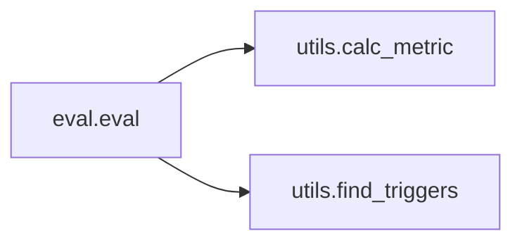

# Key Objects

[_Documentation generated by Documatic_](https://www.documatic.com)

<!---Documatic-section-eval.eval-start--->
## eval.eval

<!---Documatic-section-eval-start--->


### Object Calls

* utils.calc_metric
* utils.find_triggers

<!---Documatic-block-eval.eval-start--->
<details>
	<summary><code>eval.eval</code> code snippet</summary>

```python
def eval(model, iterator, fname):
    model.eval()
    (words_all, triggers_all, triggers_hat_all, arguments_all, arguments_hat_all) = ([], [], [], [], [])
    with torch.no_grad():
        for (i, batch) in enumerate(iterator):
            (tokens_x_2d, entities_x_3d, postags_x_2d, triggers_y_2d, arguments_2d, seqlens_1d, head_indexes_2d, words_2d, triggers_2d) = batch
            (trigger_logits, triggers_y_2d, trigger_hat_2d, argument_hidden, argument_keys) = model.module.predict_triggers(tokens_x_2d=tokens_x_2d, entities_x_3d=entities_x_3d, postags_x_2d=postags_x_2d, head_indexes_2d=head_indexes_2d, triggers_y_2d=triggers_y_2d, arguments_2d=arguments_2d)
            words_all.extend(words_2d)
            triggers_all.extend(triggers_2d)
            triggers_hat_all.extend(trigger_hat_2d.cpu().numpy().tolist())
            arguments_all.extend(arguments_2d)
            if len(argument_keys) > 0:
                (argument_logits, arguments_y_1d, argument_hat_1d, argument_hat_2d) = model.module.predict_arguments(argument_hidden, argument_keys, arguments_2d)
                arguments_hat_all.extend(argument_hat_2d)
            else:
                batch_size = len(arguments_2d)
                argument_hat_2d = [{'events': {}} for _ in range(batch_size)]
                arguments_hat_all.extend(argument_hat_2d)
    (triggers_true, triggers_pred, arguments_true, arguments_pred) = ([], [], [], [])
    with open('temp', 'w') as fout:
        for (i, (words, triggers, triggers_hat, arguments, arguments_hat)) in enumerate(zip(words_all, triggers_all, triggers_hat_all, arguments_all, arguments_hat_all)):
            triggers_hat = triggers_hat[:len(words)]
            triggers_hat = [idx2trigger[hat] for hat in triggers_hat]
            triggers_true.extend([(i, *item) for item in find_triggers(triggers)])
            triggers_pred.extend([(i, *item) for item in find_triggers(triggers_hat)])
            for trigger in arguments['events']:
                (t_start, t_end, t_type_str) = trigger
                for argument in arguments['events'][trigger]:
                    (a_start, a_end, a_type_idx) = argument
                    arguments_true.append((i, t_start, t_end, t_type_str, a_start, a_end, a_type_idx))
            for trigger in arguments_hat['events']:
                (t_start, t_end, t_type_str) = trigger
                for argument in arguments_hat['events'][trigger]:
                    (a_start, a_end, a_type_idx) = argument
                    arguments_pred.append((i, t_start, t_end, t_type_str, a_start, a_end, a_type_idx))
            for (w, t, t_h) in zip(words[1:-1], triggers, triggers_hat):
                fout.write('{}\t{}\t{}\n'.format(w, t, t_h))
            fout.write('#arguments#{}\n'.format(arguments['events']))
            fout.write('#arguments_hat#{}\n'.format(arguments_hat['events']))
            fout.write('\n')
    print('[trigger classification]')
    (trigger_p, trigger_r, trigger_f1) = calc_metric(triggers_true, triggers_pred)
    print('P={:.3f}\tR={:.3f}\tF1={:.3f}'.format(trigger_p, trigger_r, trigger_f1))
    print('[argument classification]')
    (argument_p, argument_r, argument_f1) = calc_metric(arguments_true, arguments_pred)
    print('P={:.3f}\tR={:.3f}\tF1={:.3f}'.format(argument_p, argument_r, argument_f1))
    print('[trigger identification]')
    triggers_true = [(item[0], item[1], item[2]) for item in triggers_true]
    triggers_pred = [(item[0], item[1], item[2]) for item in triggers_pred]
    (trigger_p_, trigger_r_, trigger_f1_) = calc_metric(triggers_true, triggers_pred)
    print('P={:.3f}\tR={:.3f}\tF1={:.3f}'.format(trigger_p_, trigger_r_, trigger_f1_))
    print('[argument identification]')
    arguments_true = [(item[0], item[1], item[2], item[3], item[4], item[5]) for item in arguments_true]
    arguments_pred = [(item[0], item[1], item[2], item[3], item[4], item[5]) for item in arguments_pred]
    (argument_p_, argument_r_, argument_f1_) = calc_metric(arguments_true, arguments_pred)
    print('P={:.3f}\tR={:.3f}\tF1={:.3f}'.format(argument_p_, argument_r_, argument_f1_))
    metric = '[trigger classification]\tP={:.3f}\tR={:.3f}\tF1={:.3f}\n'.format(trigger_p, trigger_r, trigger_f1)
    metric += '[argument classification]\tP={:.3f}\tR={:.3f}\tF1={:.3f}\n'.format(argument_p, argument_r, argument_f1)
    metric += '[trigger identification]\tP={:.3f}\tR={:.3f}\tF1={:.3f}\n'.format(trigger_p_, trigger_r_, trigger_f1_)
    metric += '[argument identification]\tP={:.3f}\tR={:.3f}\tF1={:.3f}\n'.format(argument_p_, argument_r_, argument_f1_)
    final = fname + '.P%.2f_R%.2f_F%.2f' % (trigger_p, trigger_r, trigger_f1)
    with open(final, 'w') as fout:
        result = open('temp', 'r').read()
        fout.write('{}\n'.format(result))
        fout.write(metric)
    os.remove('temp')
    return metric
```
</details>
<!---Documatic-block-eval.eval-end--->
<!---Documatic-section-eval-end--->

# #
<!---Documatic-section-eval.eval-end--->

<!---Documatic-section-data_load.pad-start--->
## data_load.pad

<!---Documatic-section-pad-start--->
<!---Documatic-block-data_load.pad-start--->
<details>
	<summary><code>data_load.pad</code> code snippet</summary>

```python
def pad(batch):
    (tokens_x_2d, entities_x_3d, postags_x_2d, triggers_y_2d, arguments_2d, seqlens_1d, head_indexes_2d, words_2d, triggers_2d) = list(map(list, zip(*batch)))
    maxlen = np.array(seqlens_1d).max()
    for i in range(len(tokens_x_2d)):
        tokens_x_2d[i] = tokens_x_2d[i] + [0] * (maxlen - len(tokens_x_2d[i]))
        postags_x_2d[i] = postags_x_2d[i] + [0] * (maxlen - len(postags_x_2d[i]))
        head_indexes_2d[i] = head_indexes_2d[i] + [0] * (maxlen - len(head_indexes_2d[i]))
        triggers_y_2d[i] = triggers_y_2d[i] + [trigger2idx[PAD]] * (maxlen - len(triggers_y_2d[i]))
        entities_x_3d[i] = entities_x_3d[i] + [[entity2idx[PAD]] for _ in range(maxlen - len(entities_x_3d[i]))]
    return (tokens_x_2d, entities_x_3d, postags_x_2d, triggers_y_2d, arguments_2d, seqlens_1d, head_indexes_2d, words_2d, triggers_2d)
```
</details>
<!---Documatic-block-data_load.pad-end--->
<!---Documatic-section-pad-end--->

# #
<!---Documatic-section-data_load.pad-end--->

<!---Documatic-section-train.train-start--->
## train.train

<!---Documatic-section-train-start--->
<!---Documatic-block-train.train-start--->
<details>
	<summary><code>train.train</code> code snippet</summary>

```python
def train(model, iterator, optimizer, criterion):
    model.train()
    for (i, batch) in enumerate(iterator):
        (tokens_x_2d, entities_x_3d, postags_x_2d, triggers_y_2d, arguments_2d, seqlens_1d, head_indexes_2d, words_2d, triggers_2d) = batch
        optimizer.zero_grad()
        (trigger_logits, triggers_y_2d, trigger_hat_2d, argument_hidden, argument_keys) = model.module.predict_triggers(tokens_x_2d=tokens_x_2d, entities_x_3d=entities_x_3d, postags_x_2d=postags_x_2d, head_indexes_2d=head_indexes_2d, triggers_y_2d=triggers_y_2d, arguments_2d=arguments_2d)
        trigger_logits = trigger_logits.view(-1, trigger_logits.shape[-1])
        trigger_loss = criterion(trigger_logits, triggers_y_2d.view(-1))
        if len(argument_keys) > 0:
            (argument_logits, arguments_y_1d, argument_hat_1d, argument_hat_2d) = model.module.predict_arguments(argument_hidden, argument_keys, arguments_2d)
            argument_loss = criterion(argument_logits, arguments_y_1d)
            loss = trigger_loss + 2 * argument_loss
            if i == 0:
                print('=====sanity check for arguments======')
                print('arguments_y_1d:', arguments_y_1d)
                print('arguments_2d[0]:', arguments_2d[0]['events'])
                print('argument_hat_2d[0]:', argument_hat_2d[0]['events'])
                print('=======================')
        else:
            loss = trigger_loss
        nn.utils.clip_grad_norm_(model.parameters(), 1.0)
        loss.backward()
        optimizer.step()
        if i == 0:
            print('=====sanity check======')
            print('tokens_x_2d[0]:', tokenizer.convert_ids_to_tokens(tokens_x_2d[0])[:seqlens_1d[0]])
            print('entities_x_3d[0]:', entities_x_3d[0][:seqlens_1d[0]])
            print('postags_x_2d[0]:', postags_x_2d[0][:seqlens_1d[0]])
            print('head_indexes_2d[0]:', head_indexes_2d[0][:seqlens_1d[0]])
            print('triggers_2d[0]:', triggers_2d[0])
            print('triggers_y_2d[0]:', triggers_y_2d.cpu().numpy().tolist()[0][:seqlens_1d[0]])
            print('trigger_hat_2d[0]:', trigger_hat_2d.cpu().numpy().tolist()[0][:seqlens_1d[0]])
            print('seqlens_1d[0]:', seqlens_1d[0])
            print('arguments_2d[0]:', arguments_2d[0])
            print('=======================')
        if i % 10 == 0:
            print('step: {}, loss: {}'.format(i, loss.item()))
```
</details>
<!---Documatic-block-train.train-end--->
<!---Documatic-section-train-end--->

# #
<!---Documatic-section-train.train-end--->

<!---Documatic-section-utils.build_vocab-start--->
## utils.build_vocab

<!---Documatic-section-build_vocab-start--->
<!---Documatic-block-utils.build_vocab-start--->
<details>
	<summary><code>utils.build_vocab</code> code snippet</summary>

```python
def build_vocab(labels, BIO_tagging=True):
    all_labels = [PAD, NONE]
    for label in labels:
        if BIO_tagging:
            all_labels.append('B-{}'.format(label))
            all_labels.append('I-{}'.format(label))
        else:
            all_labels.append(label)
    label2idx = {tag: idx for (idx, tag) in enumerate(all_labels)}
    idx2label = {idx: tag for (idx, tag) in enumerate(all_labels)}
    return (all_labels, label2idx, idx2label)
```
</details>
<!---Documatic-block-utils.build_vocab-end--->
<!---Documatic-section-build_vocab-end--->

# #
<!---Documatic-section-utils.build_vocab-end--->

<!---Documatic-section-utils.report_to_telegram-start--->
## utils.report_to_telegram

<!---Documatic-section-report_to_telegram-start--->
<!---Documatic-block-utils.report_to_telegram-start--->
<details>
	<summary><code>utils.report_to_telegram</code> code snippet</summary>

```python
def report_to_telegram(text, bot_token, chat_id):
    try:
        import requests
        requests.get('https://api.telegram.org/bot{}/sendMessage?chat_id={}&text={}'.format(bot_token, chat_id, text))
    except Exception as e:
        print(e)
```
</details>
<!---Documatic-block-utils.report_to_telegram-end--->
<!---Documatic-section-report_to_telegram-end--->

# #
<!---Documatic-section-utils.report_to_telegram-end--->

<!---Documatic-section-utils.find_triggers-start--->
## utils.find_triggers

<!---Documatic-section-find_triggers-start--->
<!---Documatic-block-utils.find_triggers-start--->
<details>
	<summary><code>utils.find_triggers</code> code snippet</summary>

```python
def find_triggers(labels):
    result = []
    labels = [label.split('-') for label in labels]
    for i in range(len(labels)):
        if labels[i][0] == 'B':
            result.append([i, i + 1, labels[i][1]])
    for item in result:
        j = item[1]
        while j < len(labels):
            if labels[j][0] == 'I':
                j = j + 1
                item[1] = j
            else:
                break
    return [tuple(item) for item in result]
```
</details>
<!---Documatic-block-utils.find_triggers-end--->
<!---Documatic-section-find_triggers-end--->

# #
<!---Documatic-section-utils.find_triggers-end--->

<!---Documatic-section-utils.calc_metric-start--->
## utils.calc_metric

<!---Documatic-section-calc_metric-start--->
<!---Documatic-block-utils.calc_metric-start--->
<details>
	<summary><code>utils.calc_metric</code> code snippet</summary>

```python
def calc_metric(y_true, y_pred):
    num_proposed = len(y_pred)
    num_gold = len(y_true)
    y_true_set = set(y_true)
    num_correct = 0
    for item in y_pred:
        if item in y_true_set:
            num_correct += 1
    print('proposed: {}\tcorrect: {}\tgold: {}'.format(num_proposed, num_correct, num_gold))
    if num_proposed != 0:
        precision = num_correct / num_proposed
    else:
        precision = 1.0
    if num_gold != 0:
        recall = num_correct / num_gold
    else:
        recall = 1.0
    if precision + recall != 0:
        f1 = 2 * precision * recall / (precision + recall)
    else:
        f1 = 0
    return (precision, recall, f1)
```
</details>
<!---Documatic-block-utils.calc_metric-end--->
<!---Documatic-section-calc_metric-end--->

# #
<!---Documatic-section-utils.calc_metric-end--->

[_Documentation generated by Documatic_](https://www.documatic.com)